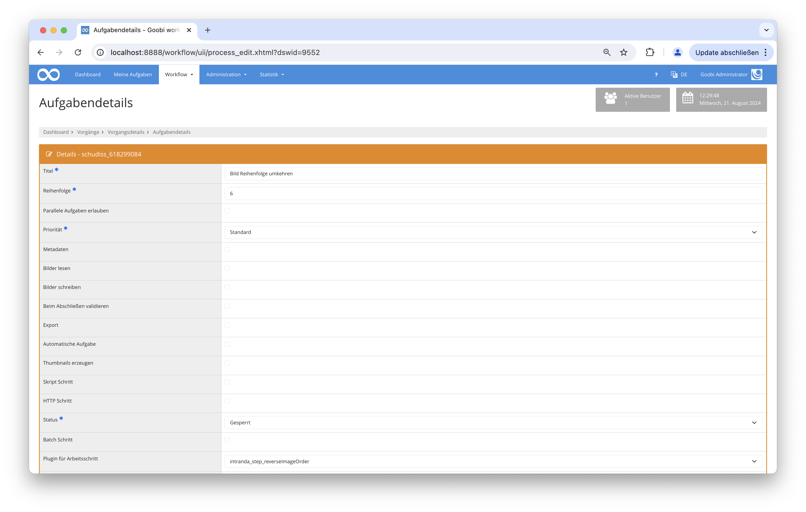

## Einführung
Dieses Schritt-Plugin für den Goobi-Workflow kehrt die Dateireihenfolge von Bildern im Goobi-Workflow basierend auf dem Metadatenfeld `DocLanguage` um.

## Installation
Um das Plugin nutzen zu können, müssen folgende Dateien installiert werden:

```bash
/opt/digiverso/goobi/plugins/step/plugin-step-reverse-image-order-base.jar
/opt/digiverso/goobi/config/plugin_intranda_step_reverseImageOrder.xml
```

Für die Verwendung des Plugins muss dieses in einem Arbeitsschritt ausgewählt sein:




## Überblick und Funktionsweise
Das Plugin vergleicht alle Sprachen die in dem Dokument vorkommen mit den in der Konfigurationsdatei festgelegten Sprachen. Sollte eine Übereinstimmung gefunden werden, dann werden die Bilder in der Reihenfolge umgekehrt. 


## Konfiguration
Die Konfiguration des Plugins erfolgt in der Datei `plugin_intranda_step_reverseImageOrderPlugin.xml` wie hier aufgezeigt:

{{CONFIG_CONTENT}}

{{CONFIG_DESCRIPTION_PROJECT_STEP}}

Parameter               | Erläuterung
------------------------|------------------------------------
`language`              | Dieser Parameter gibt eine Liste von Sprachen an, für die die Reihenfolge der Bilder im Dokument umgekehrt werden soll. Die Sprachen werden als ISO-Sprachcodes (z.B. "he" für Hebräisch, "ar" für Arabisch) angegeben. |
`project`               | Es können mehrere Projekte oder mit "*" alle Projekte angegeben werden, bei denen das Plugin angewendet werden soll. |
`step`                  | Gibt an, bei welchen Bearbeitungsschritten die Konfiguration für das Umkehren der Reihenfolge gültig sein soll. |
