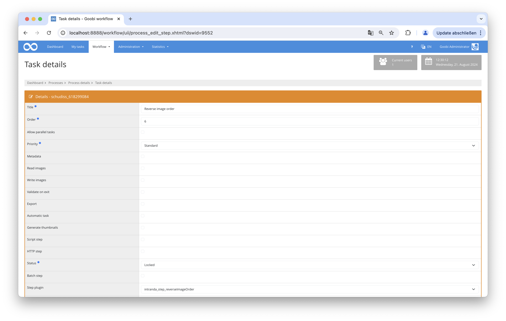

## Introduction
This step plugin for the Goobi workflow reverses the file order of images in the Goobi workflow based on the metadata field `DocLanguage` .

## Installation
To be able to use the plugin, the following files must be installed:

```bash
/opt/digiverso/goobi/plugins/step/plugin-step-reverse-image-order-base.jar
/opt/digiverso/goobi/config/plugin_intranda_step_reverseImageOrder.xml
```

To use the plugin, it must be selected in a workflow step:




## Overview and functionality
The plugin compares all languages present in the document with the languages specified in the configuration file. If a match is found, the images are reversed in order.

## Configuration
The plugin is configured in the file `plugin_intranda_step_reverseImageOrderPlugin.xml` as shown here:

{{CONFIG_CONTENT}}

{{CONFIG_DESCRIPTION_PROJECT_STEP}}

Parameter               | Explanation
------------------------|------------------------------------
`language`              | This parameter specifies a list of languages for which the image order in the document should be reversed. The languages are given as ISO language codes (e.g., "he" for Hebrew, "ar" for Arabic). |
`project`               | Multiple projects can be specified, or "*" can be used to indicate all projects where the plugin should be applied. |
`step`                      | Specifies the workflow steps for which the configuration for reversing the order should be valid. |
